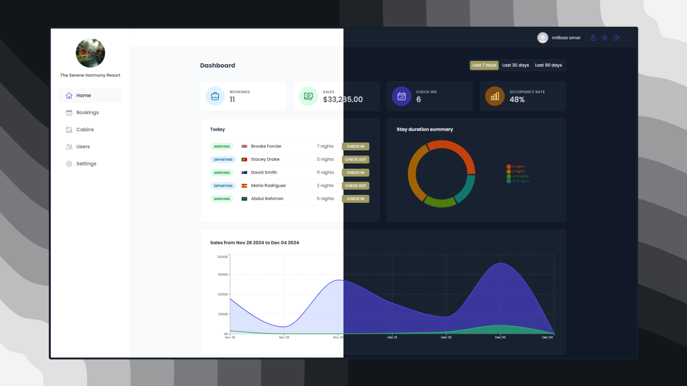

<div align="center">
  

  <h1>The Serene Resort Harmony - Admin</h1>

  <h3>
    <a href="https://www.the-serene-resort.me/">
      <strong>Live Site</strong>
    </a>
  </h3>

  <div align="center">
    <a href="https://www.the-serene-resort.me/">View website</a>
    • <a href="https://github.com/mtibaa-omar/The-Serene-Harmony-Resort/issues">Report Bug</a>
    • <a href="https://github.com/mtibaa-omar/The-Serene-Harmony-Resort/pulls">Request Feature</a>
  </div>

  <hr />
</div>

<!-- Badges -->
<div align="center">
  
  <br/>
  [](https://www.linkedin.com/in/omar-mtibaa-337032327/)

</div>

<!-- Brief -->
<p align="center">
  Welcome to <b>The Serene Resort Harmony</b>! This hotel management web app is designed to empower employees to efficiently manage cabins, bookings, and guest information. Built on a robust backend powered by Supabase, the application leverages cutting-edge React techniques, including Higher-Order Components (HOCs) and React Query, to ensure seamless performance and exceptional user experience.

</p>

<!-- Screenshot -->
<a align="center" href="https://www.the-serene-resort.me/">
  
  
  
</a>

## Live Site

Check out the live admin app here: [The Serene Harmony Resort- Admin](https://www.the-serene-resort.me/)

## Key Features

- Secure User Authentication: Ensures that only authorized hotel employees can access the system.
- Employee Profile Management: Employees can update their profiles, upload avatars, and change passwords with ease.
- Comprehensive Dashboard: Gain insights at a glance with recent stats on bookings, check-ins, and sales.
- Cabin Management: Effortlessly create, update, or delete cabin records.
- Booking Management: Seamlessly handle guest check-ins and check-outs, with the ability to update booking statuses.
- Real-Time Updates: Experience instant updates for cabins and bookings changes, powered by Supabase.
- Visual Analytics: Dynamic charts showcase key metrics such as sales and occupancy rates.
- Dark Mode: Enjoy a fully functional dark mode for a personalized and comfortable user experience.

## Technologies Used

- **React** for the frontend.
- **Supabase** for the database and real-time data updates.
- **React Query** for data fetching and caching.
- **React Router** for navigation.
- **React Hook Form** for efficient form handling.
- **Recharts** for data visualization (charts and stats).
- **Styled Components** for styling the UI, including dark mode.
- **Vite** for development environment and build system.

## Setup Instructions

To run this project locally:

1. Clone the repo:

   ```bash
   git clone https://github.com/mtibaa-omar/The-Serene-Harmony-Resort.git
   ```

2. Install dependencies:

   ```bash
   npm install
   ```

3. Run the development server:
   ```bash
   npm run dev
   ```
4. Open [http://localhost:5173](http://localhost:5173)
   to see the app.

## Author

<b>👤 Mtibaa omar</b>

- LinkedIn - [@MtibaaOmar](https://www.linkedin.com/in/omar-mtibaa-337032327/)<br/>

Feel free to reach out with any questions, suggestions, or feedback!
